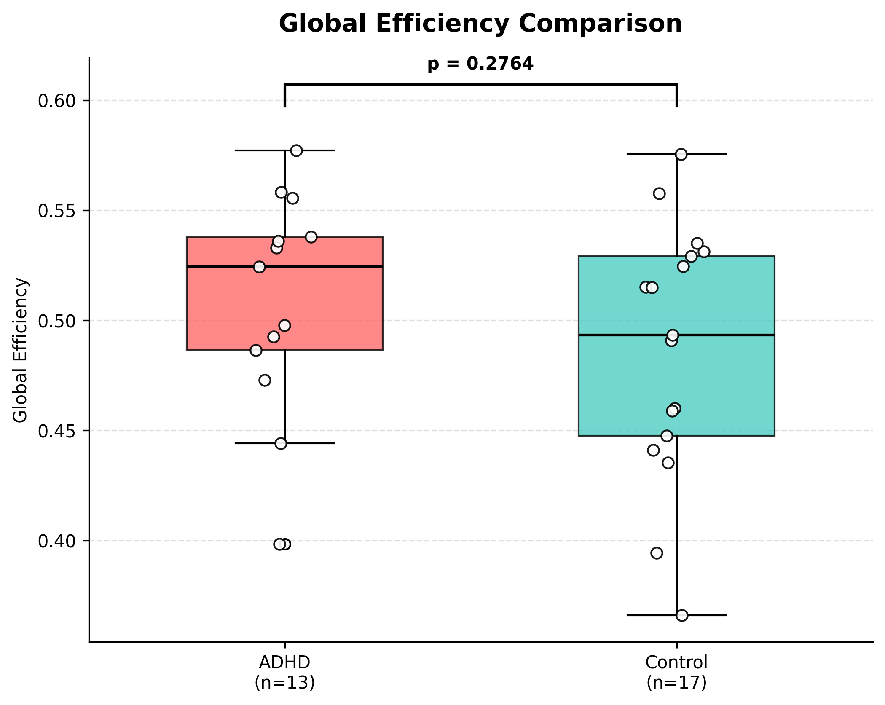

# 🧠 ADHD Brain Network Analysis: fMRI Graph Theory Pipeline


Bu proje, **ADHD-200** veri setini kullanarak, Dikkat Eksikliği ve Hiperaktivite Bozukluğu (ADHD) olan bireyler ile sağlıklı kontrollerin beyin ağ topolojilerini karşılaştıran uçtan uca bir **Nörogörüntüleme Analiz Hattı (Pipeline)** sunar.

Proje, fMRI verilerini işleyerek beynin **Global Verimliliğini (Global Efficiency)** ve **Yerel Kümelenmesini (Clustering Coefficient)** analiz eder.

---

## 🔬 Proje Özeti & Amaç

ADHD'nin nörobiyolojik temellerini anlamak için beynin fonksiyonel bağlantılarını (Functional Connectivity) inceledik.
* **Hipotez 1 (Otobanlar):** ADHD'li bireylerde beynin uzun mesafeli iletişimi (Global Efficiency) bozuk mudur?
* **Hipotez 2 (Mahalleler):** ADHD'li bireylerde yerel ağ bağlantıları (Clustering Coefficient) farklı mıdır?

### ⚙️ Kullanılan Metodoloji
1.  **Veri Seti:** Peking Üniversitesi (ADHD-200) veri seti (Nilearn ile otomatik indirme).
2.  **Atlas:** AAL (Automated Anatomical Labeling) Atlası ile 116 beyin bölgesi (ROI) çıkarımı.
3.  **Preprocessing:** Sinyal maskeleme, detrending ve z-score standardizasyonu.
4.  **Network Modelleme:** Bölgesel zaman serileri arasındaki korelasyon matrislerinin çıkarılması.
5.  **Graph Theory:** `NetworkX` kütüphanesi ile beynin matematiksel grafiğe dökülmesi.
6.  **İstatistik:** Bağımsız örneklem T-Testi (Independent T-Test).

---

## 📊 Sonuçlar ve Görseller

30 denek üzerinde (ADHD vs Kontrol) gerçekleştirilen analiz sonuçları aşağıdadır.

### 1. Global Efficiency (Uzun Mesafe İletişim)
Beynin genel entegrasyon kapasitesini ölçer.
* **Sonuç:** İstatistiksel olarak anlamlı bir fark bulunamamıştır (`p > 0.05`).
* **Yorum:** ADHD'li bireylerde beynin genel iletişim otobanları (Global Efficiency) korunmuştur.



### 2. Clustering Coefficient (Yerel Ağ Bağlantısı)
Beynin yerel bölgelerinin (komşuların) birbirine bağlanma derecesini ölçer.
* **Sonuç:** Gruplar arasında belirgin bir fark gözlemlenmemiştir (`p > 0.05`).
* **Yorum:** Beynin "Small-World" (Küçük Dünya) mimarisi ve yerel işleme kapasitesi her iki grupta da benzerdir.


---

## 🛠️ Kurulum ve Çalıştırma

Bu proje **Docker** üzerinde çalışacak şekilde tasarlanmıştır, bu sayede kurulum karmaşası yaşanmaz.

### Seçenek A: Docker ile (Önerilen)

1. **Repoyu Klonlayın:**
   ```bash
   git clone [https://github.com/KULLANICI_ADIN/adhd-network-efficiency.git](https://github.com/KULLANICI_ADIN/adhd-network-efficiency.git)
   cd adhd-network-efficiency
   ```
   Docker Konteynerini Başlatın:

```bash
docker-compose up --build
Jupyter Notebook'a Erişin: Terminalde çıkan linke tıklayarak (örn: http://127.0.0.1:8888/?token=...) analizi inceleyebilirsiniz.

Seçenek B: Manuel Kurulum (Python)
```
```bash
pip install numpy pandas matplotlib scipy networkx nilearn scikit-learn
python analysis.py
```
📂 Dosya Yapısı
adhd-network-efficiency/
│
├── analysis.ipynb      # 🧠 Ana analiz kodları (Jupyter Notebook)
├── results/            # 📊 Çıktı grafikleri (PNG dosyaları burada)
│   ├── global_efficiency_plot.png
│   └── clustering_plot.png
├── Dockerfile          # 🐳 Docker yapılandırması
├── docker-compose.yml  # 🐳 Servis ayarları
├── requirements.txt    # 📦 Gerekli kütüphaneler
└── README.md           # 📄 Proje dokümantasyonu

👨‍💻 Geliştirici
Bu proje Fırat Üniversitesi Teknoloji Fakültesi öğrencisi tarafından geliştirilmiştir.

Geliştirici: Sena Ay

Alan: Yazılım Mühendisliği & Nörobilim (Computational Neuroscience)

İletişim: 2405411@firat.edu.tr

Not: Bu çalışma akademik bir araştırma projesi kapsamında hazırlanmıştır.
